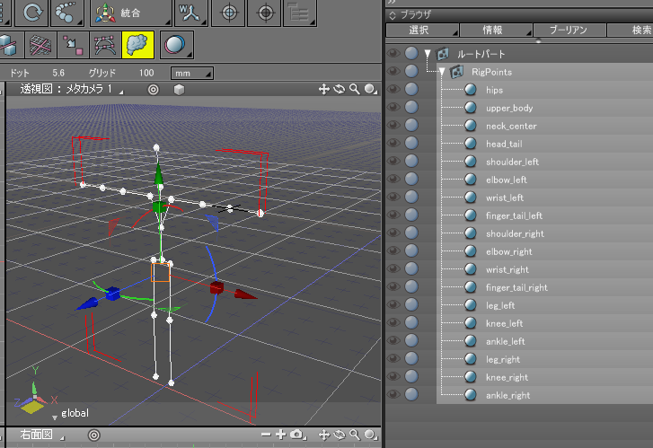

# BoneUtil (Shade3D Plugin)

「BoneUtil」は、Shade 3Dでボーンを扱う際のユーティリティープラグインです。    
ボーンのミラーリングやサイズ変更などの補助機能、人体キャラクタのボーン構造を作成する機能があります。    

Shade3Dマーケットプレイスで公開している無料プラグインのソースコードになります。    

## Shade3Dマーケットプレイスでの公開場所

https://shade3d.jp/store/marketplace/ft-lab/boneutil/boneutil.html

## 動作環境

* Windows 7/8/10以降のOS    
* macOS 10.11以降   
* Shade3D ver.15以降で、Standard/Professional版（Basic版では動作しません）  
  Shade3Dの64bit版のみで使用できます。32bit版のShade3Dには対応していません。   

## 使い方

### プラグインダウンロード

以下から最新版をダウンロードしてください。      

https://github.com/ft-lab/Shade3D_plugin_BoneUtil/releases

### プラグインを配置し、Shade3Dを起動

Windowsの場合は、ビルドされた BoneUtil64.dllをShade3Dのpluginsディレクトリに格納してShade3Dを起動。   
Macの場合は、ビルドされた BoneUtil.shdpluginをShade3Dのpluginsディレクトリに格納してShade3Dを起動。      
ブラウザの「情報」のポップアップメニューに「ボーンのリセット」や「ボーンの軸方向」などが表示されるのを確認します。   
     

## 機能

ブラウザの「情報」ポップアップメニューからそれぞれの機能にアクセスします。    

* ボーンのリセット    
選択されたボーン/ボールジョイント階層で、ボーンの変換行列の回転とスケール、ボーンジョイント属性の回転とオフセットをリセットしたボーンを複製します。    
また、ボーンの置き換えや、ボーンと関連付けられたポリゴンメッシュのスキン情報を再構成します。    
* ボーンの軸方向    
選択されたボーン/ボールジョイント階層で、ボーンジョイント属性の「自動で軸合わせ」がOffの場合に、軸方向をボーンの進行方向に統一します。    
* ボーンのリサイズ    
選択されたボーン/ボールジョイント階層で、ボーンジョイント属性のノードサイズをまとめて調整します。    
* ボーンのミラーリング    
選択されたボーン/ボールジョイント階層を反転コピーします。    
* 人体リグの制御点を初期化    
人体キャラクタの制御点を球として表現します。すでに存在する人体キャラクタ形状にこの球を位置あわせすることで、 「ボーン用メッシュを生成」で自動生成するボーン構造を形状に合わせやすくなります。    
* 人体ボーンの生成    
「人体リグの制御点を初期化」機能で配置した球にしたがって、HumanIK、またはMikuMikuDance(MMD)のボーン構造を自動生成します。    
* ボーン用メッシュを生成    
選択されたボーン階層で、個々のボーンを直方体で囲ったポリゴンメッシュを生成します。このポリゴンメッシュにはスキン割り当てが行われます。    
* ボーンをボールジョイントに変換 (ver.1.1.1.0 -)    
ボーン/ボールジョイントが混在するの階層構造で、ボーンをボールジョイントに変換します。    
* ボールジョイントをボーンに変換 (ver.1.1.1.0 -)    
ボーン/ボールジョイントが混在するの階層構造で、ボールジョイントをボーンに変換します。    

なお、それぞれの機能はUNDO/REDOには対応していません。    
以降は機能別に説明していきます。    

## ボーンのリセット

ボーンの変換行列の回転とスケール、ボーンジョイント属性の回転とオフセットをリセットする機能です。     
ボーンを選択し、ブラウザの「情報」より「ボーンのリセット」を選択することで、指定のボーンとその子階層に反映されます。    
また、実行後の「ボーンジョイント属性」はOffになります。    

この機能は、FBX形式で形状を外部にエクスポートする場合など、ボーン構造をできるだけシンプルに扱いたい場合に便利です。    

### 使い方

ボーンの変換行列の回転や拡大縮小、ボーンジョイント属性の回転やオフセットに値が入っているのを例に説明します。    

     

処理を行うボーンをブラウザで選択します。指定のボーンとその子ボーンが処理の対象になります。    

ブラウザの情報より「ボーンのリセット」を選択。    
「ボーンのリセット」ダイアログボックスが表示されます。    
     

「ボーンの置き換えとスキンの更新」をOffにして実行すると、元のボーンは残り、複製されたボーンでリセット処理が適用されます。    
Onにして実行すると、ボーンはリセット処理を行ったもので置き換えられます。    
このとき、ボーンをバインドしているポリゴンメッシュにスキンが設定されている場合は、スキンでのボーンの割り当てを入れ替えます。    

実行後、変換行列の回転はリセットされます。    
     

ボーンジョイント属性の「自動で軸合わせ」はOffになり、軸方向は(1, 0, 0)に設定されます。     
軸方向をボーンの方向にあわせるには「ボーンの軸方向」を使用するようにしてください。    

「ボーンの置き換えとスキンの更新」は、人体キャラクタをAポーズで作成、ボーン＋スキン割り当てされており、これをTポーズに変換したい場合などに有効です。    

AポーズのものをTポーズに変換したい場合は、ジョイントモードでボーンジョイント属性の回転を調整すると腕の角度を調整できますが、 モーション用のパラメータが変化しただけで、基本の姿勢自身は変わらずAポーズのままです。    
     
※ ボーンジョイント属性の回転とオフセットを0にしたものが、基本の姿勢になる。    

これを手作業でAポーズからTポーズにする場合は、    

* Tポーズに変形させた状態で、ポリゴンメッシュのスキン割り当てを削除
* オブジェクトモードで、ボーンをTポーズに調整
* ポリゴンメッシュと対応ボーンで、スキンを再度設定 (頂点ブレンドでバインド、ウエイトペイント、スキンウィンドウでのウエイト値の微調整、、、) 

の作業が発生してしまいます。    

この場合は、ジョイントモードでボーンジョイント属性の肩の回転を調整してTポーズにした後、肩部分またはボーンのルートをブラウザで選択して「情報」より「ボーンのリセット」を選択、「ボーンの置き換えとスキンの更新」をOnにして実行します。    
こうすることで、ボーンジョイント属性の回転やオフセットはリセットされて、かつ、ポリゴンメッシュのスキンも変換後のボーンに再割り当てされるため、作業を大幅に削減できます。    

     

### 注意事項

* UNDOには対応していません。
* ボーン/ボールジョイントのみに使用できます。ボーン/ボールジョイント以外のジョイントやパートと併用した場合は本機能は使用できません。
* ボーンに割り当てたモーション情報の再割り当ては考慮していません。    
モーションを割り当てる前に、本作業は行うようにしてください。
* 「ボーンの置き換えとスキンの更新」でボーンのバインド元の形状は、1つのポリゴンメッシュのみ使用できます。
* ボーンがポリゴンメッシュにスキンでバインドされている場合、「ボーンの置き換えとスキンの更新」をOnにして実行すると、ポリゴンメッシュの頂点数が多いと時間がかかります。 

## ボーンの軸方向

ボーンジョイント属性の「自動で軸合わせ」がOffの場合に、「軸方向」をボーン方向に一致させる機能です。    
図形ウィンドウ上の見た目だけの変更になり、レンダリングやモーション設定には影響しません。    

### 使い方

処理を行うボーンを選択。選択ボーンとその子ボーンが処理の対象になります。    
下の画像の場合は、+X方向にボーンの実線が伸びているのが分かります。    
     

ブラウザの「情報」より「ボーンの軸方向」を選択。    
「ボーンの軸方向」ダイアログボックスが表示されます。     
     

「ボーン方向に統一」をOnにして実行すると、ボーンの軸方向は自動で計算され、ボーンの進行方向に統一されます。    
     

「ボーン方向に統一」をOffにすると、ボーンの軸方向は(1, 0, 0)に設定されます。    

### 注意事項

* UNDO/REDOには対応していません。
* ボーン/ボールジョイントのみに使用できます。ボーン/ボールジョイント以外のジョイントやパートと併用した場合は本機能は使用できません。 

## ボーンのリサイズ

ボーンのノードサイズをまとめて変更する機能です。    
図形ウィンドウ上の見た目だけの変更になり、レンダリングやモーション設定には影響しません。    

### 使い方

処理を行うボーンを選択。選択ボーンとその子ボーンが処理の対象になります。     

ブラウザの「情報」より「ボーンのリサイズ」を選択。    
「ボーンのリサイズ」ダイアログボックスが表示されます。    
     

「距離で調整」をOnにすると、ボーン間の距離とスケール値を乗算した値でボーンサイズが調整されます。    
「距離で調整」をOffにすると、指定のボーンサイズで統一されます。    
     

### 注意事項

* UNDO/REDOには対応していません。
* ボーン/ボールジョイントのみに使用できます。ボーン/ボールジョイント以外のジョイントやパートと併用した場合は本機能は使用できません。 

## ボーンのミラーリング

XYZ軸ごとに反転させたボーンを複製します。    

### 使い方

処理を行うボーンを選択。選択ボーンとその子ボーンが処理の対象になります。    
ブラウザの「情報」より「ボーンのミラーリング」を選択。    
「ボーンのミラーリング」ダイアログボックスが表示されます。    
     

「中心軸」で選択したXYZ軸のいずれかに「中心位置」を中心として反転複製されます。    
また、「名前変更」をOnすると、ボーン名の「元のテキスト」の記載が「変換後のテキスト」に置き換えられます。 LeftからRightにボーン名を変換する場合などに利用します。     
     

### 注意事項

* UNDO/REDOには対応していません。
* ボーン/ボールジョイントのみに使用できます。ボーン/ボールジョイント以外のジョイントやパートと併用した場合は本機能は使用できません。 
* 複製されたボーンまたはボールジョイントは、変換行列の回転とスケールがない状態、ボーンジョイント属性の回転とオフセットが0の状態になります。
* ボーンのモーション情報は複製されません。 

## 人体リグの制御点を初期化

人体キャラクタの関節の要点となる位置を球であらわし、これを移動して位置合わせをした後に「人体ボーンの生成」を実行することで、人体向けのボーン構造を生成することができます。    

### 使い方

ブラウザの「情報」より「人体リグの制御点を初期化」を選択。    
「人体リグの制御点を初期化」ダイアログボックスが表示されます。    
     

原点を接地する足の中央としたときの「身長」を指定します。    
「ポーズ」でT-Pose / A-Pose(30度)/A-Pose(45度)から人体のポーズを指定します。    
T-Poseは腕を水平に伸ばした姿勢、A-Poseは腕を水平から少し下ろした姿勢になります。A-Poseは、水平から30度下ろしたものと45度下ろしたものを選択できます。    
     
「ミラーリング」をOnにすると、左腕と右腕、左足と右足、それぞれの球を移動させた場合に反対側の対称の球も移動します。    

「OK」ボタンを押すと、「RigPoints」という名前のパート内に以下の球が配置されます。    
     

|形状名|役割|
|---|---|
|hips|尻、股の中心|
|upper_body|上半身の中央|
|neck_center|首の中央|
|head_tail|頭の先|
|shoulder_left|左肩|
|elbow_left|左ひじ|
|wrist_left|左手首|
|finger_tail_left|左指先|
|shoulder_right|右肩|
|elbow_right|右ひじ|
|wrist_right|右手首|
|finger_tail_right|右指先|
|leg_left|左足|
|knee_left|左ひざ|
|ankle_left|左かかと|
|leg_right|右足|
|knee_right|右ひざ|
|ankle_right|右かかと|

これらの球をオブジェクトモードで移動させて、ボーン構成を当てはめる人体キャラクタにあわせていきます。    
これを元にしたボーンの生成については「人体ボーンの生成」を参照してください。    

### 注意事項

* UNDO/REDOには対応していません。
* 「RigPoints」のパート名や、その中の球の名前は変更せずに使用してください。    
* ボーンを生成して使い終わった後は、削除して問題ありません。 

## 人体ボーンの生成

「人体リグの制御点を初期化」で作成した人体キャラクタの制御点を元に、 ボーンを生成します。     
ボーンの種類として、HumanIKの構造とMikuMikuDance(MMD)の構造に対応しています。    

### 使い方

「人体リグの制御点を初期化」で制御点の球を作成。    

ブラウザの「情報」より「人体ボーンの生成」を選択。    
「人体ボーンの生成」ダイアログボックスが表示されます。    
     

「ボーンの種類」として、「HumanIK」「MMD(jp)」「MMD(en)」の3つから選択できます。    
「HumanIK」は、Autodesk社のMayaなどで生成/使用できる人体キャラクタ向けのボーン構成です。 ボーン名は「xxxx_Hips」「xxxx_LeftShoulder」のように、「名前 + ボーン名」で構成されます。    
ボーン構成とボーン名のルールが一致していると、他のツールのHumanIK対応の人体キャラクタのモーションデータと互換性がとりやすいです。    

「人体ボーンの生成」ダイアログボックスのオプショングループの「目」と「あご」を選択すると、 両目に対応するボーンとあごに対応するボーンが生成されます。これについては、本プラグインで拡張したものです。    

「名前」を指定すると、HumanIK時のボーン名は「名前_Hips」「名前_LeftShoulder」のように命名されます。     

「ボーンの種類」で「MMD(jp)」「MMD(en)」を選択すると、MMD用の標準的なボーン構成とボーン名を生成します。    
「jp」は日本語のボーン名、「en」は英語のボーン名となります。    

以下のような人体キャラクタの制御点位置から、ボーンを生成します。    
     
HumanIK用のボーンを生成した場合は以下のようになります。    
     
MMD用のボーンを生成した場合は以下のようになります。     
     

### ボーンを当てはめる例

以下のように、すでに形状が存在するキャラクタにボーン構造を当てはめる例を説明します。    
     
「人体リグの制御点を初期化」で、だいたいの身長とポーズの種類を指定して人体キャラクタの制御点を生成。    
     
制御点（球）をオブジェクトモードで移動させて位置合わせ。    
     
「情報」より「人体ボーンの生成」を選択し、「人体ボーンの生成」ダイアログボックスのパラメータを指定してOKボタンを押す。    
     

これで、大雑把ですがボーンが配置されました。     
後は、オブジェクトモードでボーン位置を微調整し、スキンのバインドを行うようにします。    
この段階で「RigPoints」パートとその中の球は不要になりましたので削除して問題ありません。     

### 注意事項

* UNDO/REDOには対応していません。
* ボーンを生成後、「人体リグの制御点を初期化」で生成した「RigPoints」パートが不要になった際は削除して問題ありません。
* 本機能はボーンを生成する機能だけで、スキンの割り当ては行いません。

## ボーン用メッシュを生成

ボーンを直方体の面で囲み、姿勢やモーション確認用のポリゴンメッシュを生成します。    
このポリゴンメッシュにはスキン割り当てが行われるため、そのままfbxなどにエクスポートしてボーンの動きを確認するのに利用できます。    

### 使い方

処理を行うボーンを選択。選択ボーンとその子ボーンが対象になります。    

ブラウザの「情報」より「ボーン用メッシュを生成」を選択。    
「ボーン用メッシュを生成」ダイアログボックスが表示されます。    
     
OKボタンを押すと、「スケール」で指定した値で、各ボーンをノードサイズ x スケールの大きさの直方体で囲った1つのポリゴンメッシュを生成します。    
     
ジョイントモードでボーンを選択して回転させると、ポリゴンメッシュが動きに付いてくるのを確認できます。    
     

### 注意事項

* UNDO/REDOには対応していません。
* ボーンのみに使用できます。ボーン以外のジョイントやパートと併用した場合は本機能は使用できません。 

## ボーンをボールジョイントに変換 (ver.1.1.1.0 -)

階層構造にボーンまたはボールジョイントが含まれる場合、
ボーンをボールジョイントに変換します。    

### 使い方

処理を行うボーンまたはボールジョイントを選択。選択ボーン/ボールジョイントとその子が対象になります。    

ブラウザの「情報」より「ボーンをボールジョイントに変換」を選択。    
すると、選択されたボーンまたはボールジョイントとその子をたどり、ボーンの場合はボールジョイントに置き換えます。    
     
このとき、変換行列としての回転/せん断/スケールはリセットされます。    
また、スキンが割り当てられている場合は再割り当てが行われます。    

### 注意事項

* UNDO/REDOには対応していません。
* ボーンまたはボールジョイントのみに使用できます。ボーン/ボールジョイント以外のジョイントやパートと併用した場合は本機能は使用できません。 

## ボールジョイントをボーンに変換 (ver.1.1.1.0 -)

階層構造にボーンまたはボールジョイントが含まれる場合、
ボールジョイントをボーンに変換します。    
「ボーンをボールジョイントに変換」の逆の動作を行います。    

### 使い方

処理を行うボーンまたはボールジョイントを選択。選択ボーン/ボールジョイントとその子が対象になります。    

ブラウザの「情報」より「ボールジョイントをボーンに変換」を選択。    
すると、選択されたボーンまたはボールジョイントとその子をたどり、ボールジョイントの場合はボーンに置き換えます。    
このとき、変換行列としての回転/せん断/スケールはリセットされます。    
また、スキンが割り当てられている場合は再割り当てが行われます。    

### 注意事項

* UNDO/REDOには対応していません。
* ボーンまたはボールジョイントのみに使用できます。ボーン/ボールジョイント以外のジョイントやパートと併用した場合は本機能は使用できません。 

## ビルド方法 (開発向け)

### 使用SDK

Shade 15.1 Plugin SDK (481137)    
https://github.com/shadedev/pluginsdk    

本プラグインのプロジェクトは、Visual Studio 2017/Xcode 10.1でビルドできるようにしています。    

### Windows

Visual Studio 2017 を使用しました。    

### Mac OS

Xcode 10.1 を使用しました。    

## ビルド方法

GitHubからダウンロードしたソースのprojectsフォルダ内の「BoneUtil」一式を、    
Shade 15.1 Plugin SDKの「projects」フォルダにコピーします。     

### Windows

Visual Studio 2017で「/projects/BoneUtil/win/Template.sln」を開き、ビルドします。    
Debug 64bit/Release 64bitでビルドするようにします。     
ビルドで生成された「BoneUtil64.dll」をShade3DのpluginsフォルダにコピーしてShade3Dを起動します。    

### Mac OS

Xcode 10.1で「/projects/BoneUtil/mac/plugins/Template.xcodeproj」を開き、ビルドします。    
ビルドで生成された「BoneUtil.shdplugin」をShade3DのpluginsフォルダにコピーしてShade3Dを起動します。    

## 更新履歴

[2020/01/31] ver.1.1.1.0   
* Added : 「ボーンをボールジョイントに変換」機能を追加
* Added : 「ボールジョイントをボーンに変換」機能を追加
* 「ボーンのリセット」「ボーンの軸方向」「ボーンのリサイズ」「ボーンのミラーリング」にて、ボールジョイントが階層構造に含まれていても動作するようにした。    

[2019/05/14] ver.1.1.0.0   
* ソースコードをGitHubにアップ

